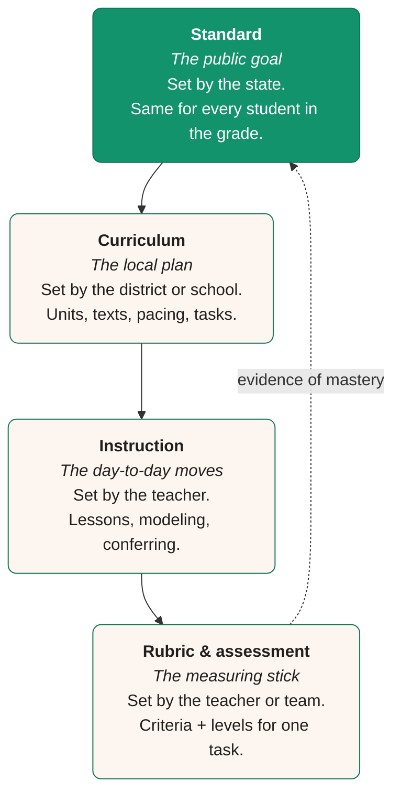
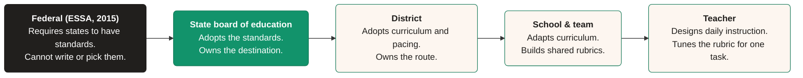
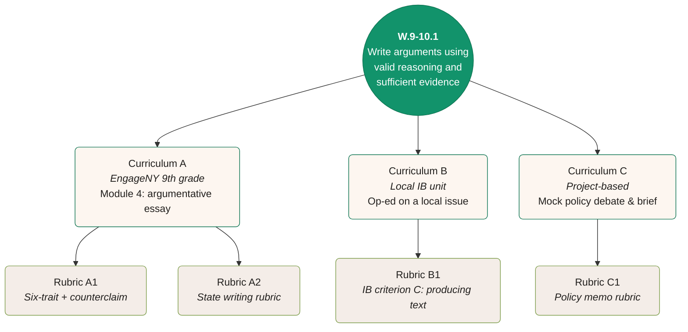
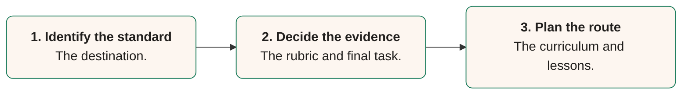

# Standards vs. curriculum vs. rubrics

  A **standard** is the destination: what every student should know and be able to do by the end of a grade or course.

  A **curriculum** is the route: the units, texts, lessons, and tasks a school chooses to get students there.

  A **rubric** is the measuring stick: the levels and descriptions teachers use to judge a single piece of student work against the standard.

  One standard. Many curricula. Many rubrics.

<Frame caption="One road, four moving parts: curriculum, instruction, rubric, standard.">
  
</Frame>

## The 30-second version

- A **standard** is a public goal: _students will write arguments using valid reasoning and sufficient evidence._
- A **curriculum** is the local plan that gets students to that goal: the units, texts, sequence, and pacing.
- A **rubric** is the tool teachers use to grade a single piece of work against the standard.
- One standard supports **many** curricula. One curriculum can be graded with **many** rubrics. Standards stay fixed; the path and the measuring stick are local choices.
- If you can change it without a state board vote, it is not a standard.

<Note>
  **Why this page exists.** Most grading problems start as definition problems. When teachers, parents, or admins use these three words interchangeably, the rubric ends up grading effort, the curriculum ends up driving the report card, and the standard quietly disappears. This page gives you the cleanest distinctions we can write, plus a diagnostic you can run on any sentence in five seconds.
</Note>

## A picture before the words

Standards, curriculum, and rubrics sit on top of each other like layers of a cake. The standard is the goal at the top. The curriculum is the route. Instruction is what happens day to day. The rubric closes the loop by sending evidence back up.

The arrow back from rubric to standard matters. A rubric only earns its keep if the evidence it produces tells you whether students are hitting the standard. A rubric that grades neatness, page count, or "effort" can get a perfect score without ever touching the standard.

## Definitions

<CardGroup cols={3}>
  <Card title="Standard" icon="flag">
    **What it is:** A public statement of what students should know and be able to do.

    **Who writes it:** A state board of education, often using a shared framework like Common Core or NGSS.

    **Time horizon:** A grade level or a course.

    **You change it by:** A formal state-level adoption process. Not by a teacher. Not by a school.
  </Card>

  <Card title="Curriculum" icon="map">
    **What it is:** The local plan for getting students to the standard. 

    **Who writes it:** A district, school, department, or teacher team. Sometimes a publisher.

    **Time horizon:** A unit, a quarter, a year, a course sequence.

    **You change it by:** A local decision. A teacher team can revise a unit between Friday and Monday.
  </Card>

  <Card title="Rubric" icon="ruler">
    **What it is:** The criteria and levels used to score one task or product against the standard.

    **Who writes it:** A teacher, a teacher team, or a curriculum publisher.

    **Time horizon:** A single assignment or a small set of similar assignments.

    **You change it by:** A teacher edit. The rubric should change when the task changes.
  </Card>
</CardGroup>

<Tip>
  A working test: if a sentence says **what students will know or do**, it is a standard. If it says **what gets taught and in what order**, it is curriculum. If it says **what counts as good or not yet there on this task**, it is a rubric.
</Tip>

## Anatomy, side by side

Each of the three has a small set of moving parts. Knowing the parts helps you read any document and place it in the right bucket.

| Moving part | Standard | Curriculum | Rubric |
| --- | --- | --- | --- |
| **Audience** | Students, families, the public | Teachers, students | Teachers, students |
| **Verb tells you** | The cognitive demand (write, model, evaluate) | The instructional move (read, draft, revise, discuss) | The level of quality (cites, names, attempts) |
| **Mentions a text or material** | No | Yes | Sometimes |
| **Changes between teachers** | No | Yes | Yes |
| **Legally binding on the school** | Yes (state board adopted) | Often (board adopted curriculum) | No |

The pattern is the same all the way down: standards are the most general and the most permanent, rubrics are the most specific and the most local, and curriculum lives in between.

## Who owns what

Confusion about these three words is usually confusion about who gets to change them. Here is the chain, from highest authority to most local.

## One standard, many paths

This is the picture most teachers wish they had seen on day one of pre-service. A single standard can be reached through many curricula. A single curriculum can be assessed with many rubrics. The standard is one. The choices below it multiply.

## W.9-10.1 worked two ways

To make the difference clear, here is the same standard with two very different units below it. Each unit ends with one rubric, and both rubrics are valid because both ask students to do the verb in the standard.

<Tabs>
  <Tab title="Standard">
    **`CCSS.ELA-LITERACY.W.9-10.1` — Argument writing, grades 9-10**

    > Write arguments to support claims in an analysis of substantive topics or texts, using valid reasoning and relevant and sufficient evidence.

    **The verbs in the standard:** _write, support, analyze._ **The non-negotiable criteria:** _valid reasoning, relevant evidence, sufficient evidence._

    Anything below this line is a local choice.
  </Tab>
  <Tab title="Unit A: Op-ed on a local issue">
    **Curriculum slice (week-by-week):**

    1. Read three op-eds about a local policy debate.
    2. Identify each author's claim, evidence, and counterclaim.
    3. Draft an 800-word op-ed on the same debate.
    4. Peer review using the rubric below.
    5. Revise. Submit to the school paper.

    **Rubric — argument and evidence (1 of 4 traits):**

    | Level | Argument and evidence |
    | --- | --- |
    | 4 | Names a clear claim, answers at least one strong counterclaim, supports both sides with specific local evidence. |
    | 3 | Names a clear claim and supports it with relevant evidence. Mentions a counterclaim. |
    | 2 | Names a claim. Evidence is general or off-topic. No counterclaim. |
    | 1 | No clear claim, or claim is unsupported. |
  </Tab>
  <Tab title="Unit B: Mock policy brief">
    **Curriculum slice (week-by-week):**

    1. Read two policy briefs and one academic article.
    2. Choose a policy position. Build an evidence table with at least six sources.
    3. Draft a 1,500-word policy brief.
    4. Mock hearing — defend the brief in a 5-minute statement plus Q&A.
    5. Revise based on the hearing transcript.

    **Rubric — claim and evidence (1 of 5 traits):**

    | Level | Claim and evidence |
    | --- | --- |
    | 4 | Claim is precise and policy-actionable. Six or more credible sources, varied in type, used in support of the claim. Strongest counterclaim is named and refuted with evidence. |
    | 3 | Claim is precise. Five credible sources used in support. A counterclaim is named. |
    | 2 | Claim is broad. Sources are mostly one type. Counterclaim is missing or only mentioned. |
    | 1 | No clear claim, or sources are not used to support it. |
  </Tab>
</Tabs>

The two units share **one** standard. Each ends with **its own** rubric, written for the specific task. A student could earn a 4 on Unit A and a 2 on Unit B in the same year. That is not a contradiction. It is the system working as designed: the standard is fixed, but the evidence has to be specific to the work in front of the teacher.

<Tip>
  The fastest classifier we know: ask the four-question test below. If you can answer all four, you have classified the sentence correctly.
</Tip>

## Where confusion comes from

Most arguments about these three words are not really about the words. They are about three honest mistakes.

<AccordionGroup>
  <Accordion title="Mistake 1: Treating the textbook table of contents as the standards.">
    A publisher's scope and sequence is curriculum, not standards. A textbook can be aligned to a standard, partially aligned, or out of sync entirely. The table of contents tells you what the publisher chose to teach. The standards tell you what the state requires. They are not the same document, and they should not be the same conversation.

    Fix: when you plan a unit, open the standards document on one screen and the curriculum on the other. Confirm each unit's "north star" standard is actually being taught at the depth the standard asks for.
  </Accordion>

  <Accordion title="Mistake 2: Writing a rubric that grades the assignment instead of the standard.">
    A rubric that scores "5 paragraphs, MLA format, no spelling errors, on time" measures compliance, not the standard. Students can hit every row of that rubric and never write a real argument.

    Fix: for every rubric row, ask the question: "If a student earns a 4 on this row, can I point to specific evidence that they did the verb in the standard?" If not, rewrite the row.
  </Accordion>

  <Accordion title="Mistake 3: Treating the rubric as the standard.">
    Rubrics are easier to write than standards. A team will spend Friday afternoon "writing the rubric" and quietly skip the harder step of unpacking the standard. The rubric becomes the goal. The standard quietly disappears.

    Fix: keep a paper copy of the standard at the top of the rubric document. Every row of the rubric should be traceable to a phrase in that standard.
  </Accordion>

  <Accordion title="Mistake 4: Treating the curriculum as untouchable.">
    The curriculum is the most flexible of the three, not the most fixed. Districts adopt it, but teachers can adapt it, swap texts, change the sequence, and rebuild the final task. The standard does not move. The curriculum should.

    Fix: when a unit is not getting students to the standard, change the unit. Do not lower the standard, and do not change the rubric to match the work students happened to produce.
  </Accordion>
</AccordionGroup>

## What breaks when you confuse them

| If you confuse... | What happens |
| --- | --- |
| **Standard with curriculum** | Teachers feel boxed in and complain that "the standards tell me what to teach Tuesday." They don't. The pacing guide does. |
| **Curriculum with standard** | A district swap of textbooks gets framed as "changing the standards." It isn't. The destination is the same; the route changed. |
| **Standard with rubric** | The grade book starts to look like a list of points instead of a record of what students can do. Mastery becomes a percentage, not a description. |
| **Rubric with standard** | Students who hit the rubric perfectly are reported as "proficient" even when the rubric never tested the standard. |
| **Rubric with curriculum** | Every assignment gets a slightly different rubric, written in a hurry, with no through-line. Students cannot tell what good work looks like. |

A useful rule of thumb: **if grades are not telling you whether students are hitting the standard, one of these three has slipped out of place.**

## How they show up in a teacher's week

<Steps>
  <Step title="Monday: plan the unit">
    Open the standards. Pick three to six the unit will _prioritize_ (not just _touch_). Write each in your own words.
  </Step>
  <Step title="Tuesday: design the assignment">
    Read the verb in the standard. Make sure the assignment asks students to do that verb, not a smaller one. (See [Align an assignment to standards](/standards/guides/align-an-assignment-to-standards).)
  </Step>
  <Step title="Wednesday: build the rubric">
    Translate the standard's criteria into 3-5 levels of proficiency. Each row should map back to a phrase in the standard. (See [Turn a standard into a rubric](/standards/guides/turn-a-standard-into-a-rubric).)
  </Step>
  <Step title="Thursday: give feedback">
    Use the standard's language in the comments. Students should be able to read the feedback and know what the standard asks of them. (See [Write feedback from a standard](/standards/guides/write-feedback-from-a-standard).)
  </Step>
  <Step title="Friday: record evidence">
    Roll up evidence by **standard**, not just by assignment. A student's record should show what they can do, not just a column of scores. (See [Map student work to skills](/standards/guides/map-student-work-to-skills).)
  </Step>
</Steps>

## Backward design

The cleanest way to keep these three lined up is to plan in the reverse order most of us were taught. **Backward design**, the framework popularized by Grant Wiggins and Jay McTighe, asks teachers to start at the end and work back.

Most of us were trained to design in the order **lessons → assignment → rubric → standard**, which is exactly the order that lets one of the three slip. Backward design forces you to write the rubric _from the standard_, and to plan the lessons _toward the rubric_. 

## Common misconceptions

<AccordionGroup>
  <Accordion title="Common Core is a curriculum.">
    No. Common Core is a set of **standards**. It says what students should know and be able to do. It does not pick textbooks, units, or pacing. Two schools that both teach Common Core can use entirely different curricula and that is by design.
  </Accordion>

  <Accordion title="If we change the rubric, we changed the standard.">
    No. Rubrics change all the time, and they should — every task is different. The standard above the rubric does not move. The rubric just tells you whether students hit the standard on this particular task.
  </Accordion>

  <Accordion title="A standards-aligned curriculum guarantees standards-aligned grading.">
    Not on its own. A curriculum can be aligned to standards in name and still be graded on assignment compliance. The rubric is the place where the standard either shows up in the grade book or quietly disappears.
  </Accordion>

  <Accordion title="Rubrics are just grading shortcuts.">
    A rubric does score work, but its main job is to make the standard concrete for students _before_ they do the work. A rubric that lives only in the teacher's grade book is half a rubric.
  </Accordion>

  <Accordion title="Different rubrics on the same standard means inconsistent grading.">
    Different rubrics for different _tasks_ are normal and good. Different rubrics for the _same_ task across classrooms is the inconsistency to worry about. The fix is a shared task and a shared rubric, not a single rubric for the whole standard.
  </Accordion>

  <Accordion title="Once a unit is built, you don't touch the curriculum again.">
    The curriculum is the most flexible of the three. When student work shows the unit is not reaching the standard, change the unit. Do not change the standard, and do not stretch the rubric to fit the work students produced.
  </Accordion>
</AccordionGroup>

## Frequently asked questions

<AccordionGroup>
  <Accordion title="Are learning objectives the same as standards?">
    No. A standard is the year-end outcome. A learning objective (sometimes called a learning target or "I can" statement) is a slice of the standard you can teach in a single lesson or week. One standard usually breaks down into several objectives.
  </Accordion>

  <Accordion title="Where does pacing live? In the standards, curriculum, or rubric?">
    Pacing is curriculum. The standard says what mastery looks like by the end of the year. The curriculum decides which weeks of the year are spent on which standard. Pacing is the most local of all curriculum decisions and the easiest to revise.
  </Accordion>

  <Accordion title="Where do state tests fit?">
    State tests are assessments built to measure the standards. They are not standards themselves, and they are not your classroom rubric. A test blueprint is the closest cousin to a rubric. It tells you how the test maps to specific standards.
  </Accordion>

  <Accordion title="Is a learning progression a standard?">
    A learning progression is a research-based map of how a skill grows from grade to grade. Standards are usually written from progressions, but the standard is the version a state adopts and your district has to teach.
  </Accordion>

  <Accordion title="What about “power standards” or “priority standards”?">
    Those are local choices about which standards a school will spend the most time on. They are not separate standards. Think of them as the curriculum's prioritization decision, sitting one level below the standards themselves.
  </Accordion>

  <Accordion title="Can a rubric be used across multiple assignments?">
    Yes, as long as the assignments ask students to do the same kind of work against the same standard. A general "writing rubric" used on a lab report and a personal narrative is almost always too loose to grade either one well. Tune the rubric to the task.
  </Accordion>

  <Accordion title="Where does feedback fit in this picture?">
    Feedback lives between the rubric and the next assignment. The rubric is the language. The feedback uses that language to point a specific student toward the next move. Feedback that does not use the rubric's language is harder for students to act on. (See [Write feedback from a standard](/standards/guides/write-feedback-from-a-standard).)
  </Accordion>
</AccordionGroup>

## Glossary

| Term | What it really means |
| --- | --- |
| **Standard** | A publicly adopted statement of what students should know and be able to do by the end of a grade or course. |
| **Anchor standard** | A K-12 outcome that grade-level standards build toward. |
| **Curriculum** | The local plan of units, texts, tasks, and pacing that walks students from where they are to the standard. |
| **Pacing guide** | A piece of curriculum that maps standards onto weeks of the school year. |
| **Scope and sequence** | A higher-level view of which standards are taught in which order across a year or course. |
| **Learning objective / learning target** | A weekly or daily "I can" statement. A slice of a standard. |
| **Rubric** | A scoring tool that lists criteria and levels of proficiency for one task. |
| **Single-point rubric** | A rubric with one column of "proficient" descriptors and space for "not yet" and "above and beyond" notes. |
| **Analytic rubric** | A rubric with multiple traits scored separately. |
| **Holistic rubric** | A rubric with one overall score and one descriptor per level. |
| **Backward design** | A planning sequence that starts with the standard, then builds the assessment, then plans the lessons. |
| **Alignment** | The degree to which the curriculum and rubric actually require students to do what the standard asks. |

## Where to go next

<CardGroup cols={2}>
  <Card title="What are learning standards?" icon="compass" href="/standards/guides/what-are-learning-standards">
    The full explainer on standards — who writes them, how to read the codes, and what they do not do.
  </Card>

  <Card title="Turn a standard into a rubric" icon="ruler" href="/standards/guides/turn-a-standard-into-a-rubric">
    A step-by-step way to translate any standard into a 3-5 level rubric your team can grade with.
  </Card>

  <Card title="Align an assignment to standards" icon="link" href="/standards/guides/align-an-assignment-to-standards">
    Take an existing assignment and map it to the standards it actually measures.
  </Card>

  <Card title="Write feedback from a standard" icon="message-square" href="/standards/guides/write-feedback-from-a-standard">
    Use the standard's language in comments students can act on.
  </Card>
</CardGroup>

  Standards, curriculum, and rubrics are three different tools that often get used as if they were the same thing. A standard is the public, year-end goal a state board of education adopts. A curriculum is the local plan of units, texts, and pacing that walks students to that goal. A rubric is the criteria-and-levels measuring stick a teacher uses to score one piece of work against the standard. One standard supports many curricula. One curriculum is graded with many rubrics. The standard is the part that does not move. The other two are local choices, and most grading problems start when a school confuses which is which.

