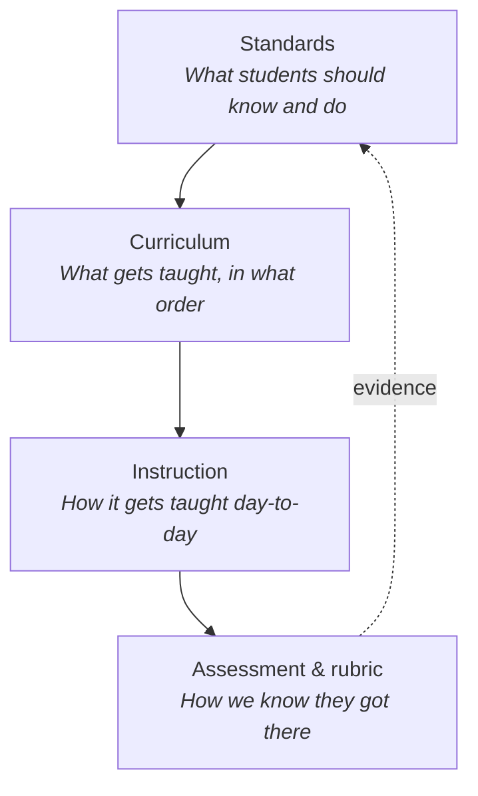

# What are learning standards?

<div class="answer-box">
Learning standards are brief and accessible descriptions of the skills plus knowledge that students must possess at every stage of their education. In the United States, individual states create and approve those requirements instead of the federal government. For this process states typically use collective guidelines like the Common Core (2010) or the Next Generation Science Standards (2013). Standards are not instructions that dictate what a teacher presents during a specific day. They are the goals that students are expected to reach. By contrast the curriculum, the daily lessons but also the evaluation tools are the methods that teachers use so that students achieve the outcomes.
</div>
<script type="application/ld+json">{`
{
  "@context": "https://schema.org",
  "@type": "BreadcrumbList",
  "itemListElement": [
    {
      "@type": "ListItem",
      "position": 1,
      "name": "Standards",
      "item": "https://standards.legend.org/standards"
    },
    {
      "@type": "ListItem",
      "position": 2,
      "name": "Guides",
      "item": "https://standards.legend.org/standards/guides"
    },
    {
      "@type": "ListItem",
      "position": 3,
      "name": "What are learning standards?",
      "item": "https://standards.legend.org/standards/guides/what-are-learning-standards"
    }
  ]
}
`}</script>
<script type="application/ld+json">{`
{
  "@context": "https://schema.org",
  "@type": "LearningResource",
  "name": "What are learning standards? A plain-English guide",
  "url": "https://standards.legend.org/standards/guides/what-are-learning-standards",
  "inLanguage": "en",
  "educationalLevel": "K-12",
  "learningResourceType": "Explainer",
  "audience": {
    "@type": "EducationalAudience",
    "educationalRole": ["teacher", "instructionalCoach", "administrator", "parent"]
  },
  "dateModified": "2026-05-06"
}
`}</script>

## The 30-second version

- A **learning standard** is a one-sentence (or one-paragraph) goal: by the end of this grade, a student should be able to do *this*.
- Standards are owned by **states**, not Washington. The federal government can require that standards exist and be "challenging," but it cannot legally write them or pick them.
- Most states share a small set of common frameworks — **Common Core** for ELA and math, **NGSS** for science, and supporting frameworks for social studies, English-language proficiency, technology, social-emotional learning, and accessibility.
- Standards are **outcomes**, not lesson plans. A standard tells you the *what* and the *how well*; the teacher and district decide the *how*.
- Every standard hides three things inside it: a **noun** (the content), a **verb** (the cognitive demand), and a **grade-level expectation** (how rigorous it should be).

<Note>
**A note on grain size.** When teachers say "standard" in everyday conversation, they sometimes mean a broad anchor (like "write arguments") and sometimes a single bullet (like `CCSS.ELA-LITERACY.W.9-10.1.a`). This page uses the word "standard" for any official statement at any level, and we point out the level when it matters.
</Note>

## A working definition

A **learning standard** is a publicly adopted statement that describes a knowledge or skill outcome a student is expected to demonstrate by the end of a defined unit of schooling — usually a grade level, a grade band (such as 9–10), or a course.

A useful standard does four things at once. It:

1. **Names a domain or discipline** — for example, *reading informational text*, *the number system*, or *molecules to organisms*.
2. **Describes a cognitive performance** — what the student must *do* with that content (cite, model, evaluate, design, explain).
3. **Sets a level of rigor** — how complex the task or text should be relative to a student's age.
4. **Is observable** — it points to evidence a teacher or assessment could collect, not just an internal feeling or attitude.

If a person removes any of those four components, they typically create a statement about worth, a goal for a curriculum or a phrase for marketing - but this result is not a standard.

## What standards do, and what they do not do

Many people find this topic difficult to understand within the education system of the United States. Because of this situation, it is necessary to describe the facts in a direct manner.

**Standards do:**

- Define the **destination** for a grade level or course.
- Make expectations **transparent** to students, families, and the public.
- Provide a **shared vocabulary** so teachers across schools, districts, and states can talk about the same skill.
- Anchor **assessments and report cards** so grades mean roughly the same thing across classrooms.
- Support **equity audits**: if a standard is not being taught somewhere, that is now visible.

**Standards do not:**

- Pick **textbooks**, software, or instructional materials.
- Set a **pacing guide** or tell you what to teach on Tuesday morning.
- Specify a **teaching method** (direct instruction, inquiry, project-based, Montessori, etc.).
- Constitute a **federal mandate** in the United States. Under the Every Student Succeeds Act (ESSA, 2015), each state writes and adopts its own.
- Replace **professional judgment**. A standard is the floor, not the ceiling, of what a great teacher does.

<Tip>
A useful test: if a sentence tells you *what a student will know or do*, it is probably a standard. If it tells you *what the teacher will do*, it is probably curriculum or pedagogy.
</Tip>

## A short history of how the U.S. got here

The United States does not have a national curriculum - it is a fact that the Tenth Amendment gives the responsibility for education to the individual states. In this system every state government writes the standards for its own schools - but it is important to note that "every state writes its own" does not indicate that "everyone reinvents the wheel". As a result of various factors, most states follow a few frameworks that are the same. On the following lines, there is an explanation of the process that led to this situation.

<Steps>
  <Step title="1989 — The first national learning goals">
    The National Council of Teachers of Mathematics publishes the *Curriculum and Evaluation Standards for School Mathematics*, the first widely adopted subject-level standards in the U.S. Other subjects (science, history, the arts) follow in the early 1990s.
  </Step>
  <Step title="1994 — Goals 2000">
    Congress passes the *Goals 2000: Educate America Act*, which encourages — but does not require — states to develop their own academic content standards.
  </Step>
  <Step title="2001 — No Child Left Behind (NCLB)">
    The No Child Left Behind Act is a mandate for every state to maintain academic requirements for reading and mathematics. In those subjects, students are in classrooms for testing every year from the third grade through the eighth grade and for one year during their time in high school. To comply with the law, states continue to produce the documents independently - but the federal government is now responsible for the enforcement of penalties if schools do not meet those goals.
  </Step>
  <Step title="2010 — Common Core State Standards (CCSS)">
    The National Governors Association Center for Best Practices and the Council of Chief State School Officers are the organizations that provide the Common Core standards for English Language Arts besides Mathematics. For most states the process to accept those standards occurs within two years - but the decision for a state to use them is voluntary. When states choose to participate, they do so by their own choice. Due to the way the program is structured, most states are in agreement with the standards in a short period of time.
  </Step>
  <Step title="2013 — Next Generation Science Standards (NGSS)">
    Achieve, working with 26 lead state partners and a 41-member writing team, releases the NGSS based on the National Research Council's 2012 *Framework for K-12 Science Education*.
  </Step>
  <Step title="2015 — Every Student Succeeds Act (ESSA)">
    ESSA replaces NCLB. It still requires every state to maintain "challenging academic standards" in reading, math, and science, but explicitly **prohibits** the federal government from mandating, incentivizing, or even reviewing any particular set of standards.
  </Step>
  <Step title="Today">
    Most states use the Common Core (sometimes renamed) for ELA and math, a growing number use NGSS for science, and many supplement with frameworks like C3, WIDA, ISTE, CASEL, and UDL for social studies, language, technology, social-emotional learning, and accessibility.
  </Step>
</Steps>

## Who actually writes the standards

A single person does not write those documents - in most cases, four categories of organizations create the majority of the requirements that a person who teaches in the United States will use.

| Type of author | Examples | What they produce |
| --- | --- | --- |
| **State departments of education** | New York State Education Department, Texas Education Agency, California Department of Education | The legally adopted standards your district must follow. |
| **State-led consortia** | NGA Center + CCSSO (Common Core); Achieve + lead states (NGSS) | Shared frameworks states can voluntarily adopt or adapt. |
| **Subject-area associations** | NCTM, NCSS (C3 Framework), ISTE, NCTE | Discipline-specific frameworks that influence state adoption. |
| **Nonprofits and research centers** | CASEL (social-emotional learning), CAST (UDL), WIDA Consortium (English-language proficiency) | Cross-cutting frameworks adopted alongside academic standards. |

<Note>
The U.S. Department of Education does **not** write academic standards. ESSA explicitly forbids it. What the federal government does do is require that states *have* standards, that those standards apply to all students (including students with disabilities and English learners), and that schools test against them.
</Note>

## How to read a standard code

Every system for standards in the United States uses a code that consists of letters and numbers. It is possible for a person to find any standard within a short period if they understand how to interpret those codes. There are four patterns that occur with the highest frequency.

### Common Core ELA

```
CCSS.ELA-LITERACY.W.9-10.1.a
└──┬──┘ └────┬────┘ │ └─┬─┘ │ │
   │        │       │   │   │ └── sub-point
   │        │       │   │   └──── standard number
   │        │       │   └──────── grade band (here: 9-10)
   │        │       └──────────── strand (W = Writing)
   │        └──────────────────── subject area
   └───────────────────────────── framework
```

To understand the process, read the text from left to right: "Common Core ELA, Writing, grades 9–10, standard 1, sub-point a." As described this method is the usual way for people to write arguments and support claims with facts.

### Common Core math

```
CCSS.MATH.CONTENT.5.NF.B.3
└──┬──┘ └─┬─┘ └─┬─┘ │ └┬┘ │ └┬┘
   │     │     │   │  │  │  └── standard within cluster
   │     │     │   │  │  └───── cluster letter
   │     │     │   │  └──────── domain (NF = Number & Operations–Fractions)
   │     │     │   └─────────── grade level (5)
   │     │     └─────────────── content vs practice
   │     └───────────────────── subject
   └─────────────────────────── framework
```

In the categorization system, the alphanumeric code identifies the fifth grade level. It refers to the cluster labeled B, which contains the third standard. By this rule a person treats a fraction as an operation of division.

### Common Core math practice

By design the practice standards are not the same as the standards for content. In this system there are eight mental habits and those behaviors continue from kindergarten through the twelfth grade.

```
CCSS.MATH.PRACTICE.MP3
                   └─┬─┘
                     └── practice number (1-8)
```

`MP3` is "Construct viable arguments and critique the reasoning of others."

### NGSS performance expectations

```
HS-LS1-1
└─┬┘ └┬┘ │
  │   │  └── number within topic
  │   └───── topic (LS1 = From Molecules to Organisms)
  └───────── grade band (HS = high school)
```

`HS-LS1-1` asks high schoolers to construct a model of how DNA and proteins drive cell function.

### WIDA English-language proficiency

WIDA codes identify a group of grades, an area of language and a level of skill. For instance the code ELD-SI.4-5.Narrate exists to show "English language development, social and instructional, grades 4–5, narrate". By looking at the code, a person sees the information that a student learns. In addition the code describes the tasks that a student must perform with language. With those characters, the system represents both the academic material and the linguistic requirements.

<Tip>
If a person encounters a code that they do not recognize, they should observe the first section of the string. It is common for this initial part to identify the framework. On that account the remaining segments function like a location for a file. There are larger categories located on the left side. As a person looks toward the right side, the items are more specific.
</Tip>

## Anatomy of a single standard

By opening one example, we can observe how people construct those documents. As we look at this Common Core writing standard for students in grades nine and ten, the structure is visible.

> *Write arguments to support claims in an analysis of substantive topics or texts, using valid reasoning and relevant and sufficient evidence.*
> — `CCSS.ELA-LITERACY.W.9-10.1`

You can break that one sentence into four moving parts.

| Part | What it does | In this example |
| --- | --- | --- |
| **The verb** | Names the cognitive performance. | *Write arguments* |
| **The object** | Names the content domain. | *claims, analysis of substantive topics or texts* |
| **The criteria** | Sets the level of rigor. | *valid reasoning, relevant and sufficient evidence* |
| **The grade band** | Says how mature the work should be. | *grades 9–10* |

A good rubric (see [Turn a standard into a rubric](/standards/guides/turn-a-standard-into-a-rubric)) is essentially a four-column table where each row is one of those moving parts, and each column is a level of proficiency.

## The verbs that hide inside standards

In a document that defines a standard, the verb serves a functional purpose. It indicates the level of mental effort that is necessary for a student to perform a task. There are two frameworks that people frequently use when they analyze the verbs in standards from the United States.

### Bloom's taxonomy (revised)

In the revision that Anderson besides Krathwohl created in 2001, the authors arrange verbs that describe thinking processes. By this arrangement, the verbs move from those that are easy to perform to the that are more difficult to perform.

1. **Remember** — recall facts, terms, basic concepts.
2. **Understand** — explain ideas in your own words.
3. **Apply** — use information in a new situation.
4. **Analyze** — break information into parts and examine relationships.
5. **Evaluate** — make judgments using criteria.
6. **Create** — produce new or original work.

### Webb's Depth of Knowledge (DOK)

Norman Webb's framework is what most state assessment offices use to rate the cognitive demand of items.

- **DOK 1 — Recall and reproduction.** Single right answer, basic facts and procedures. *Define, identify, calculate.*
- **DOK 2 — Skills and concepts.** Multiple steps with one expected answer. *Compare, summarize, classify, estimate.*
- **DOK 3 — Strategic thinking.** Reasoning, planning, justification with evidence. *Critique, develop a logical argument, formulate.*
- **DOK 4 — Extended thinking.** Investigations across multiple sources or class periods. *Design, synthesize, conduct an experiment.*

<Note>
**DOK measures complexity, not difficulty.** A long arithmetic problem is hard but still DOK 1 if it is just procedural recall. A short, open question that asks "why?" can be DOK 3.
</Note>

When you read a standard, you should underline the verb first - this specific word indicates the type of evidence that the student is required to create.

## Standards vs. curriculum vs. assessment vs. rubric

These four words are not synonyms. They sit on top of each other like a four-layer cake, and confusing them is the most common cause of misaligned grading. (We unpack this in detail in [Standards vs. curriculum vs. rubrics](/standards/guides/standards-vs-curriculum-vs-rubrics).)



A useful one-line distinction:

- A **standard** says, *"Students will write arguments using valid reasoning and sufficient evidence."*
- A **curriculum** says, *"In Unit 3, students read three op-eds, then draft and revise a 1,200-word argument essay."*
- An **instructional choice** is, *"On Tuesday we will model a counter-argument paragraph using a mentor text."*
- A **rubric** says, *"To earn 4/4 on Reasoning, the argument must answer at least one strong counterclaim with evidence."*

In many cases dozens of different curricula and rubrics use the same standard. It is a planned part of the system that the standard functions in this way.

## The major U.S. frameworks at a glance

The information below lists the frameworks that are present in documents for U.S. K-12 standards. Each entry is a summary that is one line long. And there is a link for each framework that leads to a page on this site with more information.

<CardGroup cols={2}>
  <Card title="Common Core State Standards" href="/standards/common-core" icon="book-open">
    English Language Arts and Mathematics standards used by most U.S. states. Released 2010 by the NGA Center and CCSSO.
  </Card>
  <Card title="Next Generation Science Standards" href="/standards/ngss" icon="flask-conical">
    In 2013 Achieve and 26 states that led the process released those criteria for science. It includes three parts which are practices, concepts that apply across subjects and ideas that are core to the discipline. To represent information, the standards are three dimensional.
  </Card>
  <Card title="C3 Framework" href="/standards/c3-framework" icon="landmark">
    The National Council for the Social Studies published a text in 2013. It is a guide for the study of society and includes information about colleges, careers plus civic life.
  </Card>
  <Card title="WIDA" href="/standards/wida" icon="languages">
    The WIDA Consortium of states uses standards for how well a student speaks, reads and writes the English language - those rules are in place because they provide help to students who speak more than one language.
  </Card>
  <Card title="ISTE Standards" href="/standards/iste" icon="laptop">
    Standards for digital learning, computational thinking, and educational technology, published by the International Society for Technology in Education.
  </Card>
  <Card title="CASEL framework" href="/standards/casel" icon="heart-handshake">
    There are five core competencies for social emotional learning. In this framework, the components are the ways that people perceive themselves, the ways that people control their own actions, the ways that individuals understand others, the ways that people interact with each other and the ways that people make choices that consider consequences.
  </Card>
  <Card title="UDL guidelines" href="/standards/udl" icon="accessibility">
    The CAST Universal Design for Learning guidelines include the areas of engagement, representation and also action and expression. The accessibility lens for any standard.
  </Card>
  <Card title="State-specific standards" href="/standards/state-standards" icon="map">
    In multiple states, administrative bodies choose to operate individual educational frameworks. To illustrate this, Texas uses the TEKS, Virginia employs the SOLs besides Florida utilizes the BEST Standards. By doing so those states do not implement the Common Core standards. It is common for the regions to manage those unique systems independently.
  </Card>
</CardGroup>

For a side-by-side comparison of how the same skill is named across frameworks, see the [framework crosswalks](/standards/reference/framework-crosswalks) reference page.

## How standards show up in a teacher's week

In theory standards exist as concepts that are not physical - in practice, they are present in every location. There is a description of how a classroom operates during a typical week when the participants recognize those requirements.

| When | What you do | The standard's role |
| --- | --- | --- |
| **Planning a unit** | Choose the 3–6 standards the unit will *prioritize* (not just *touch*). | The unit's "north star." See [Align an assignment to standards](/standards/guides/align-an-assignment-to-standards). |
| **Designing an assignment** | Make sure the task asks the student to do the verb in the standard, not a smaller verb. | The cognitive bar for the task. |
| **Building a rubric** | Translate the standard's criteria into 3–4 levels of proficiency. | The grading lens. See [Turn a standard into a rubric](/standards/guides/turn-a-standard-into-a-rubric). |
| **Giving feedback** | Use the standard's language so students know what to fix. | The shared vocabulary. See [Write feedback from a standard](/standards/guides/write-feedback-from-a-standard). |
| **Reporting a grade** | Roll up evidence by standard, not just by assignment. | The unit of reporting. See [Map student work to skills](/standards/guides/map-student-work-to-skills). |
| **Differentiating** | Adjust the path to the standard, not the standard itself. | The fixed point you do not move. See [Differentiate feedback by standard](/standards/guides/differentiate-feedback-by-standard). |

## Common misconceptions

<AccordionGroup>
  <Accordion title="“Common Core is a federal curriculum.”">
    No. The Common Core is a set of **standards**, not a curriculum, and it was written by a state-led consortium (NGA Center + CCSSO), not by the federal government. ESSA explicitly prohibits the federal government from mandating, incentivizing, or reviewing any state's standards.
  </Accordion>
  <Accordion title="“Standards tell me what to teach every day.”">
    Standards tell you the destination by the end of a unit, course, or grade. The day-to-day path is your **curriculum** and **instruction**, both of which are local decisions. Two excellent teachers can take very different routes through the same standard.
  </Accordion>
  <Accordion title="“If I cover all the standards, students will pass the test.”">
    "Covering" is different from "teaching to mastery" - in a standard, there is an action and a degree of difficulty. It is often the case that those require a Level 3 or higher on the Depth of Knowledge scale. If a teacher uses only Level 1 activities to instruct for a Level 3 standard, students are not prepared. Because of this discrepancy, the result is the same regardless of how many individual lessons a teacher completes.
  </Accordion>
  <Accordion title="“Standards limit creative teaching.”">
    In reality the situation differs from the common assumption - because the standard is fixed, a teacher can develop any method that helps students achieve it. As the standard is the final point of progress, the teacher determines the specific steps of the process.
  </Accordion>
  <Accordion title="“My state writes its own standards, so the Common Core does not apply.”">
    In some states the government gave the Common Core new names. As examples officials renamed the standards in Arizona, Indiana besides Tennessee - but those states kept the majority of the original content. Then again different states use frameworks that are separate from the national system. For instance Texas uses the TEKS, Virginia uses the SOLs or Florida uses the BEST Standards. To understand the requirements, you must read the document that your state government approved. It is the only set of rules that governs what you teach in your classroom by law.
  </Accordion>
  <Accordion title="“Standards and learning objectives are the same thing.”">
    A **standard** is the year-end (or course-end) outcome. A **learning objective** (sometimes called a learning target or "I can" statement) is the slice of that outcome a student is working on this week or this lesson. A standard usually breaks down into many objectives.
  </Accordion>
</AccordionGroup>

## A plain-English glossary

| Term | What it really means |
| --- | --- |
| **Anchor standard** | A broad K-12 goal that grade-level standards spiral up to (CCSS ELA uses these). |
| **Cluster** | A small group of standards inside a domain that share a focus. |
| **Domain** | A big topic area within a grade (for example, "Number & Operations – Fractions"). |
| **Strand** | The biggest slice of a subject (Reading, Writing, Speaking & Listening, Language). |
| **Performance expectation** | NGSS's term for a single standard. Each one bundles a science practice, a crosscutting concept, and a core idea. |
| **Anchor text / anchor task** | A grade-level example used to illustrate the rigor of a standard. |
| **Vertical alignment** | How the same skill grows in complexity from grade to grade. |
| **Horizontal alignment** | How the standards are taught consistently across classrooms in the same grade. |
| **Crosswalk** | A side-by-side document mapping standards from one framework (or state) to another. |
| **Learning target / "I can" statement** | A student-friendly slice of a standard for a single lesson or week. |
| **Mastery / proficiency** | A judgment that a student can independently do what the standard requires, on grade-level material, more than once. |
| **Power standard / priority standard** | A locally chosen subset of standards that a school agrees to prioritize when time is short. |

## Frequently asked questions

<AccordionGroup>
  <Accordion title="Are learning standards a U.S.-only concept?">
    No. Most countries publish a national curriculum or set of standards. The U.S. is unusual mainly in that the standards are written and owned by **states**, not the national government, and that the country has converged on shared frameworks voluntarily rather than by law.
  </Accordion>
  <Accordion title="How often do standards change?">
    The process occurs slowly - it is a fact that the Common Core standards from 2010 are in the same form as when they were first published. Many states change their academic requirements every 7 - 10 years. Due to the management of CASEL besides UDL by individual non profit organizations, those frameworks receive updates more often.
  </Accordion>
  <Accordion title="Who legally owns the standards in my classroom?">
    By the time a state board of education adopts a particular document, the local school district is required to follow that text. If a state uses the Common Core, the legal requirements are contained within the version that the state board formally approved. There are sometimes additions in those documents that apply only to that specific state.
  </Accordion>
  <Accordion title="How are standards different for students with IEPs or 504 plans?">
    Under ESSA, the **same** content standards apply to all students, with one narrow exception: students with the most significant cognitive disabilities can be assessed against alternate achievement standards aligned to the same content. The standard does not change for most students; the supports, scaffolds, and accommodations on the path to the standard do. (See the [UDL guidelines](/standards/udl) for the design lens.)
  </Accordion>
  <Accordion title="What is the difference between a standard and a benchmark?">
    In some states officials use the term "benchmark" when they identify a specific individual standard. As an example the state of Florida uses this name for the BEST Standards. In other states people use "benchmark" if they describe a test that students take during the middle of the school year. It is important that you verify the specific meaning of this word in your own state. By checking the local definition, you ensure the information is accurate.
  </Accordion>
  <Accordion title="Do private schools have to follow learning standards?">
    In most cases private schools are not required to follow the same rules as public institutions - those schools determine their own goals for what students should learn - but many private schools choose to use the Common Core, the Next Generation Science Standards or rules from accreditation groups. For those schools, such standards are useful because the frameworks describe how "grade level" functions within the educational system of the United States.
  </Accordion>
</AccordionGroup>

## Where to go next

<CardGroup cols={2}>
  <Card title="Standards vs. curriculum vs. rubrics" href="/standards/guides/standards-vs-curriculum-vs-rubrics" icon="layers">
    Tell the four layers apart in plain English, with worked examples.
  </Card>
  <Card title="Turn a standard into a rubric" href="/standards/guides/turn-a-standard-into-a-rubric" icon="ruler">
    Step-by-step: convert any standard into a 4-level proficiency rubric.
  </Card>
  <Card title="Align an assignment to standards" href="/standards/guides/align-an-assignment-to-standards" icon="link">
    By a process of comparison, you can align a task that you currently employ with the academic requirements that the task evaluates in practice.
  </Card>
  <Card title="Browse all U.S. standards" href="/standards" icon="library">
    On this platform common core, NGSS, state standards and the major frameworks are present - those documents are described with words that are easy to understand.
  </Card>
</CardGroup>

<div class="citation">
  <dl>
    <dt>Primary sources</dt>
    <dd>
      Common Core State Standards Initiative — <a href="https://www.thecorestandards.org/about-the-standards/">About the Standards</a><br />
      NGA Center & CCSSO — <a href="https://www.thecorestandards.org/about-the-standards/development-process/">Development Process</a><br />
      Next Generation Science Standards — <a href="https://www.nextgenscience.org/">nextgenscience.org</a><br />
      Achieve — <a href="https://www.achieve.org/next-generation-science-standards-released">NGSS release announcement</a><br />
      U.S. Department of Education — <a href="https://www.ed.gov/laws-and-policy/laws-preschool-grade-12-education/every-student-succeeds-act-essa">Every Student Succeeds Act (ESSA)</a><br />
      CASEL — <a href="https://www.casel.org/fundamentals-of-sel/what-is-the-casel-framework/">What Is the CASEL Framework?</a><br />
      WIDA Consortium — <a href="https://wida.wisc.edu/">wida.wisc.edu</a><br />
      ISTE — <a href="https://iste.org/standards">ISTE Standards</a><br />
      CAST — <a href="https://udlguidelines.cast.org/">UDL Guidelines</a><br />
      National Council for the Social Studies — <a href="https://www.socialstudies.org/standards/c3">C3 Framework</a>
    </dd>
    <dt>Cognitive frameworks referenced</dt>
    <dd>
      Anderson, L. W., &amp; Krathwohl, D. R. (Eds.). (2001). <i>A Taxonomy for Learning, Teaching, and Assessing: A Revision of Bloom's Taxonomy of Educational Objectives</i>.<br />
      Webb, N. L. (1997, 1999). Depth-of-Knowledge research, Wisconsin Center for Education Research.
    </dd>
    <dt>Last updated</dt>
    <dd>2026-05-06</dd>
  </dl>
</div>
<div class="canonical-summary">
In the United States, individual states adopt learning standards to describe what students in kindergarten through 12th grade should understand and perform when they finish each school year. It is common for states to write and approve those requirements - using collective frameworks like the Common Core State Standards (2010), the Next Generation Science Standards (2013), the C3 Framework, WIDA, ISTE, CASEL besides UDL. By federal law (ESSA, 2015) states are required to keep "challenging academic standards" but this law also prevents the federal government from controlling the specific information in the documents. As the standards establish the final goals for education, teachers use curriculum, instruction plus rubrics to help students reach those goals.
</div>
