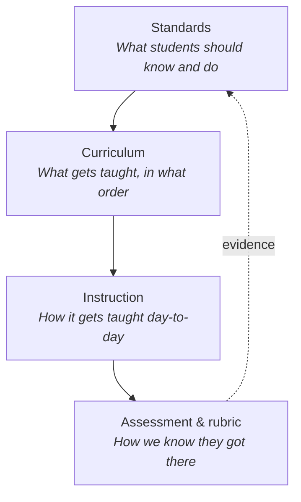

# What are learning standards?

<div class="answer-box">
A learning standard is a short statement of what a student should know and be able to do by the end of a grade or course. In the United States, states write and adopt their own standards, usually starting from shared frameworks like the Common Core (2010) or the Next Generation Science Standards (2013). Standards are not lesson plans. They are the goals. Curriculum and assessment are how teachers get students there.
</div>
<script type="application/ld+json">{`
{
  "@context": "https://schema.org",
  "@type": "BreadcrumbList",
  "itemListElement": [
    {
      "@type": "ListItem",
      "position": 1,
      "name": "Standards",
      "item": "https://standards.legend.org/standards"
    },
    {
      "@type": "ListItem",
      "position": 2,
      "name": "Guides",
      "item": "https://standards.legend.org/standards/guides"
    },
    {
      "@type": "ListItem",
      "position": 3,
      "name": "What are learning standards?",
      "item": "https://standards.legend.org/standards/guides/what-are-learning-standards"
    }
  ]
}
`}</script>
<script type="application/ld+json">{`
{
  "@context": "https://schema.org",
  "@type": "LearningResource",
  "name": "What are learning standards? A guide",
  "url": "https://standards.legend.org/standards/guides/what-are-learning-standards",
  "inLanguage": "en",
  "educationalLevel": "K-12",
  "learningResourceType": "Explainer",
  "audience": {
    "@type": "EducationalAudience",
    "educationalRole": ["teacher", "instructionalCoach", "administrator", "parent"]
  },
  "dateModified": "2026-05-06"
}
`}</script>

## The 30-second version

- A **learning standard** is a one-sentence (or one-paragraph) goal: by the end of this grade, a student should be able to do *this*.
- Standards are owned by **states**, not Washington. The federal government can require that standards exist and be "challenging," but it cannot legally write them or pick them.
- Most states share a small set of common frameworks. **Common Core** anchors ELA and math. **NGSS** anchors science. Other frameworks cover social studies, English-language proficiency, technology, social-emotional learning, and accessibility.
- Standards are **outcomes**, not lesson plans. A standard tells you the *what* and the *how well*; the teacher and district decide the *how*.
- Every standard names a **noun** (the content) and a **verb** (the cognitive demand). It also sets a **grade-level expectation** that pins down how rigorous the work should be.

<Note>
**A note on grain size.** When teachers say "standard" in everyday conversation, they sometimes mean a broad anchor (like "write arguments") and sometimes a single bullet (like `CCSS.ELA-LITERACY.W.9-10.1.a`). This page uses the word "standard" for any official statement at any level, and we point out the level when it matters.
</Note>

## A working definition

A **learning standard** is a publicly adopted statement that describes what a student should know or be able to do by the end of a grade level or course. (A standard can also span a grade band like 9-10.)

A useful standard does four things at once. It:

1. **Names a domain or discipline.** Examples include *reading informational text* or *the number system*.
2. **Describes a cognitive performance.** It names the verb the student must do with that content (cite, model, evaluate, design, explain).
3. **Sets a level of rigor.** It says how complex the task or text should be for a student that age.
4. **Is observable.** It points to evidence a teacher or assessment could collect, not just an internal feeling.

Drop any one of those four pieces and what's left isn't a standard. It's a slogan, or a curriculum goal in disguise.

## What standards do, and what they do not do

This trips up a lot of people. Here is what standards actually do, in plain terms.

**Standards do:**

- Define the **destination** for a grade level or course.
- Make expectations **transparent** to students and families.
- Provide a **shared vocabulary** so teachers across districts can talk about the same skill.
- Anchor **assessments and report cards** so grades mean roughly the same thing across classrooms.
- Support **equity audits**: if a standard is not being taught somewhere, that is now visible.

**Standards do not:**

- Pick **textbooks** or instructional materials.
- Set a **pacing guide** or tell you what to teach on Tuesday morning.
- Specify a **teaching method** (direct instruction, inquiry, project-based, Montessori, and so on).
- Constitute a **federal mandate** in the United States. Under the Every Student Succeeds Act (ESSA, 2015), each state writes and adopts its own.
- Replace **professional judgment**. A standard is the floor of what a great teacher does, not the ceiling.

<Tip>
A useful test: if a sentence tells you *what a student will know or do*, it is probably a standard. If it tells you *what the teacher will do*, it is probably curriculum or pedagogy.
</Tip>

## A short history of how the U.S. got here

The United States has no national curriculum. The Tenth Amendment leaves education to the states, so each state writes its own standards. That doesn't mean every state reinvents the wheel. Most states adopt a few common frameworks, voluntarily. Here is how it got that way.

<Steps>
  <Step title="1989: The first national learning goals">
    The National Council of Teachers of Mathematics publishes the *Curriculum and Evaluation Standards for School Mathematics*, the first widely adopted subject-level standards in the U.S. Other subjects (science, history, the arts) follow in the early 1990s.
  </Step>
  <Step title="1994: Goals 2000">
    Congress passes the *Goals 2000: Educate America Act*. It encourages states to develop their own academic content standards but stops short of requiring it.
  </Step>
  <Step title="2001: No Child Left Behind (NCLB)">
    NCLB requires every state to maintain academic standards in reading and math. Students take tests against those standards every year from grade 3 through grade 8, and once in high school. States still write the documents themselves. The federal government enforces penalties when schools miss the bar.
  </Step>
  <Step title="2010: Common Core State Standards (CCSS)">
    The NGA Center for Best Practices and the Council of Chief State School Officers release the Common Core for ELA and math. Adoption is voluntary, but most states sign on within two years.
  </Step>
  <Step title="2013: Next Generation Science Standards (NGSS)">
    Achieve releases NGSS, working with 26 lead state partners and a 41-member writing team. It builds on the National Research Council's 2012 *Framework for K-12 Science Education*.
  </Step>
  <Step title="2015: Every Student Succeeds Act (ESSA)">
    ESSA replaces NCLB. It still requires every state to keep "challenging academic standards" in reading, math, and science. But it explicitly **prohibits** the federal government from mandating or incentivizing any particular set of standards. The feds aren't even allowed to review them.
  </Step>
  <Step title="Today">
    Most states use the Common Core (sometimes renamed) for ELA and math. A growing number use NGSS for science. Many also pull from frameworks like C3, WIDA, ISTE, CASEL, and UDL to cover social studies, language, technology, social-emotional learning, and accessibility.
  </Step>
</Steps>

## Who actually writes the standards

Standards aren't written by a single person. In most cases, four kinds of organizations produce the documents teachers actually work from.

| Type of author | Examples | What they produce |
| --- | --- | --- |
| **State departments of education** | New York State Education Department, Texas Education Agency, California Department of Education | The legally adopted standards your district must follow. |
| **State-led consortia** | NGA Center + CCSSO (Common Core); Achieve + lead states (NGSS) | Shared frameworks states can voluntarily adopt or adapt. |
| **Subject-area associations** | NCTM, NCSS (C3 Framework), ISTE, NCTE | Discipline-specific frameworks that influence state adoption. |
| **Nonprofits and research centers** | CASEL (social-emotional learning), CAST (UDL), WIDA Consortium (English-language proficiency) | Cross-cutting frameworks adopted alongside academic standards. |

<Note>
The U.S. Department of Education does **not** write academic standards. ESSA explicitly forbids it. What the federal government can require is narrower: that states have standards covering all students (including students with disabilities and English learners), and that schools test against them.
</Note>

## How to read a standard code

Every U.S. standards system uses a code made of letters and numbers. Once you can read the code, you can find any standard fast. Four patterns cover most of what you'll see.

### Common Core ELA

```
CCSS.ELA-LITERACY.W.9-10.1.a
└──┬──┘ └────┬────┘ │ └─┬─┘ │ │
   │        │       │   │   │ └── sub-point
   │        │       │   │   └──── standard number
   │        │       │   └──────── grade band (here: 9-10)
   │        │       └──────────── strand (W = Writing)
   │        └──────────────────── subject area
   └───────────────────────────── framework
```

Read it left to right: "Common Core ELA, Writing, grades 9-10, standard 1, sub-point a." That sub-standard covers how students should support claims with evidence.

### Common Core math

```
CCSS.MATH.CONTENT.5.NF.B.3
└──┬──┘ └─┬─┘ └─┬─┘ │ └┬┘ │ └┬┘
   │     │     │   │  │  │  └── standard within cluster
   │     │     │   │  │  └───── cluster letter
   │     │     │   │  └──────── domain (NF = Number and Operations: Fractions)
   │     │     │   └─────────── grade level (5)
   │     │     └─────────────── content vs practice
   │     └───────────────────── subject
   └─────────────────────────── framework
```

Read this one as "fifth grade, Number and Operations: Fractions domain, cluster B, standard 3." The standard itself: students learn to interpret a fraction as a division of the numerator by the denominator.

### Common Core math practice

The practice standards are different from the content standards. There are eight mental habits, and they apply from kindergarten through twelfth grade.

```
CCSS.MATH.PRACTICE.MP3
                   └─┬─┘
                     └── practice number (1-8)
```

`MP3` is "Construct viable arguments and critique the reasoning of others."

### NGSS performance expectations

```
HS-LS1-1
└─┬┘ └┬┘ │
  │   │  └── number within topic
  │   └───── topic (LS1 = From Molecules to Organisms)
  └───────── grade band (HS = high school)
```

`HS-LS1-1` asks high schoolers to construct a model of how DNA and proteins drive cell function.

### WIDA English-language proficiency

A WIDA code names the grade band, the language area, and the skill it expects. For example, `ELD-SI.4-5.Narrate` decodes as "English language development, social and instructional, grades 4-5, narrate." Each code tells you both the academic content the student is learning and the language task they need to perform with it.

<Tip>
If you see a code you don't recognize, look at the first section. It usually names the framework. The rest reads like a file path: broad categories on the left, more specific ones as you move right.
</Tip>

## Anatomy of a single standard

One example makes the structure obvious. Here is a Common Core writing standard for grades 9-10.

> *Write arguments to support claims in an analysis of substantive topics or texts, using valid reasoning and relevant and sufficient evidence.*
>
> `CCSS.ELA-LITERACY.W.9-10.1`

You can break that one sentence into four moving parts.

| Part | What it does | In this example |
| --- | --- | --- |
| **The verb** | Names the cognitive performance. | *Write arguments* |
| **The object** | Names the content domain. | *claims, analysis of substantive topics or texts* |
| **The criteria** | Sets the level of rigor. | *valid reasoning, relevant and sufficient evidence* |
| **The grade band** | Says how mature the work should be. | *grades 9-10* |

A good rubric (see [Turn a standard into a rubric](/standards/guides/turn-a-standard-into-a-rubric)) is essentially a four-column table where each row is one of those moving parts, and each column is a level of proficiency.

## The verbs that hide inside standards

The verb in a standard does real work. It tells you how much cognitive effort the task requires. Two frameworks dominate how U.S. educators analyze those verbs.

### Bloom's taxonomy (revised)

Anderson and Krathwohl revised Bloom's taxonomy in 2001. They arrange thinking verbs from easiest to hardest.

1. **Remember.** Recall facts and basic concepts.
2. **Understand.** Explain ideas in your own words.
3. **Apply.** Use information in a new situation.
4. **Analyze.** Break information into parts and examine relationships.
5. **Evaluate.** Make judgments using criteria.
6. **Create.** Produce new or original work.

### Webb's Depth of Knowledge (DOK)

Norman Webb's framework is what most state assessment offices use to rate the cognitive demand of items.

- **DOK 1: Recall and reproduction.** Single right answer, basic facts and procedures. *Define, identify, calculate.*
- **DOK 2: Skills and concepts.** Multiple steps with one expected answer. *Compare, summarize, classify, estimate.*
- **DOK 3: Strategic thinking.** Reasoning and justification with evidence. *Critique, develop a logical argument, formulate.*
- **DOK 4: Extended thinking.** Investigations across multiple sources or class periods. *Design, synthesize, conduct an experiment.*

<Note>
**DOK measures complexity, not difficulty.** A long arithmetic problem is hard but still DOK 1 if it is just procedural recall. A short, open question that asks "why?" can be DOK 3.
</Note>

When you read a standard, underline the verb first. That word tells you what kind of evidence the student needs to produce.

## Standards vs. curriculum vs. assessment vs. rubric

These four words are not synonyms. They sit on top of each other like a four-layer cake, and confusing them is the most common cause of misaligned grading. (We unpack this in detail in [Standards vs. curriculum vs. rubrics](/standards/guides/standards-vs-curriculum-vs-rubrics).)



A useful one-line distinction:

- A **standard** says, *"Students will write arguments using valid reasoning and sufficient evidence."*
- A **curriculum** says, *"In Unit 3, students read three op-eds, then draft and revise a 1,200-word argument essay."*
- An **instructional choice** is, *"On Tuesday we will model a counter-argument paragraph using a mentor text."*
- A **rubric** says, *"To earn 4/4 on Reasoning, the argument must answer at least one strong counterclaim with evidence."*

Dozens of different curricula and rubrics can sit on top of the same standard. That is by design.

## The major U.S. frameworks at a glance

Here are the frameworks that show up in U.S. K-12 standards documents. Each card is a one-line summary, and each links to a deeper page on this site.

<CardGroup cols={2}>
  <Card title="Common Core State Standards" href="/standards/common-core" icon="book-open">
    English Language Arts and Mathematics standards used by most U.S. states. Released in 2010 by the NGA Center and CCSSO.
  </Card>
  <Card title="Next Generation Science Standards" href="/standards/ngss" icon="flask-conical">
    Science standards built on three dimensions: practices, crosscutting concepts, and disciplinary core ideas. Released in 2013 by Achieve and 26 lead state partners.
  </Card>
  <Card title="C3 Framework" href="/standards/c3-framework" icon="landmark">
    Published by the National Council for the Social Studies in 2013 to guide K-12 social studies. C3 stands for College, Career, and Civic Life.
  </Card>
  <Card title="WIDA" href="/standards/wida" icon="languages">
    The WIDA Consortium of states publishes standards for English-language proficiency, helping schools serve multilingual students.
  </Card>
  <Card title="ISTE Standards" href="/standards/iste" icon="laptop">
    Published by the International Society for Technology in Education. Covers digital learning and computational thinking across grades.
  </Card>
  <Card title="CASEL framework" href="/standards/casel" icon="heart-handshake">
    Five core social-emotional competencies: self-awareness, self-management, social awareness, relationship skills, and responsible decision-making.
  </Card>
  <Card title="UDL guidelines" href="/standards/udl" icon="accessibility">
    CAST's Universal Design for Learning guidelines cover engagement, representation, and action & expression. The accessibility lens for any standard.
  </Card>
  <Card title="State-specific standards" href="/standards/state-standards" icon="map">
    Some states write their own frameworks instead of adopting Common Core. Examples include Texas (TEKS), Virginia (SOLs), and Florida (BEST Standards).
  </Card>
</CardGroup>

For a side-by-side comparison of how the same skill is named across frameworks, see the [framework crosswalks](/standards/reference/framework-crosswalks) reference page.

## How standards show up in a teacher's week

On paper, standards are abstract. In a real classroom week, they show up everywhere. Here is how.

| When | What you do | The standard's role |
| --- | --- | --- |
| **Planning a unit** | Choose the 3-6 standards the unit will *prioritize* (not just *touch*). | The unit's "north star." See [Align an assignment to standards](/standards/guides/align-an-assignment-to-standards). |
| **Designing an assignment** | Make sure the task asks the student to do the verb in the standard, not a smaller verb. | The cognitive bar for the task. |
| **Building a rubric** | Translate the standard's criteria into 3-4 levels of proficiency. | The grading lens. See [Turn a standard into a rubric](/standards/guides/turn-a-standard-into-a-rubric). |
| **Giving feedback** | Use the standard's language so students know what to fix. | The shared vocabulary. See [Write feedback from a standard](/standards/guides/write-feedback-from-a-standard). |
| **Reporting a grade** | Roll up evidence by standard, not just by assignment. | The unit of reporting. See [Map student work to skills](/standards/guides/map-student-work-to-skills). |
| **Differentiating** | Adjust the path to the standard, not the standard itself. | The fixed point you do not move. See [Differentiate feedback by standard](/standards/guides/differentiate-feedback-by-standard). |

## Common misconceptions

<AccordionGroup>
  <Accordion title="“Common Core is a federal curriculum.”">
    No. The Common Core is a set of **standards**, not a curriculum, and it was written by a state-led consortium (NGA Center + CCSSO), not by the federal government. ESSA explicitly prohibits the federal government from mandating or even reviewing any state's standards.
  </Accordion>
  <Accordion title="“Standards tell me what to teach every day.”">
    Standards tell you the destination by the end of a unit or course. The day-to-day path is your **curriculum** and **instruction**, both local decisions. Two excellent teachers can take very different routes through the same standard.
  </Accordion>
  <Accordion title="“If I cover all the standards, students will pass the test.”">
    "Covering" is not the same as "teaching to mastery." Every standard names both an action and a level of difficulty, and many sit at DOK 3 or higher. If you teach a DOK 3 standard with only DOK 1 activities, students will not be ready, no matter how many lessons you finish.
  </Accordion>
  <Accordion title="“Standards limit creative teaching.”">
    Standards are the destination, not the route. Because the standard is fixed, you can use whatever method gets students there.
  </Accordion>
  <Accordion title="“My state writes its own standards, so the Common Core does not apply.”">
    Some states renamed the Common Core but kept most of the content (Arizona and Indiana are two examples). Other states wrote their own frameworks instead. Texas (TEKS), Virginia (SOLs), and Florida (BEST) are the most prominent. The rule is the same either way: the only document that legally governs what you teach is the one your state board approved.
  </Accordion>
  <Accordion title="“Standards and learning objectives are the same thing.”">
    A **standard** is the year-end (or course-end) outcome. A **learning objective** (sometimes called a learning target or "I can" statement) is the slice of that outcome a student is working on this week or this lesson. A standard usually breaks down into many objectives.
  </Accordion>
</AccordionGroup>

## A glossary

| Term | What it really means |
| --- | --- |
| **Anchor standard** | A broad K-12 goal that grade-level standards spiral up to (CCSS ELA uses these). |
| **Cluster** | A small group of standards inside a domain that share a focus. |
| **Domain** | A big topic area within a grade (for example, "Number and Operations: Fractions"). |
| **Strand** | The biggest slice of a subject (Reading, Writing, Speaking & Listening, Language). |
| **Performance expectation** | NGSS's term for a single standard. Each one bundles a science practice, a crosscutting concept, and a core idea. |
| **Anchor text / anchor task** | A grade-level example used to illustrate the rigor of a standard. |
| **Vertical alignment** | How the same skill grows in complexity from grade to grade. |
| **Horizontal alignment** | How the standards are taught consistently across classrooms in the same grade. |
| **Crosswalk** | A side-by-side document mapping standards from one framework (or state) to another. |
| **Learning target / "I can" statement** | A student-friendly slice of a standard for a single lesson or week. |
| **Mastery / proficiency** | A judgment that a student can independently do what the standard requires, on grade-level material, more than once. |
| **Power standard / priority standard** | A locally chosen subset of standards that a school agrees to prioritize when time is short. |

## Frequently asked questions

<AccordionGroup>
  <Accordion title="Are learning standards a U.S.-only concept?">
    No. Most countries publish a national curriculum or set of standards. The U.S. is unusual mainly in that the standards are written and owned by **states**, not the national government, and that the country has converged on shared frameworks voluntarily rather than by law.
  </Accordion>
  <Accordion title="How often do standards change?">
    Slowly. The Common Core has been unchanged since 2010. Most states refresh their academic requirements every 7-10 years. Frameworks managed by individual nonprofits, like CASEL and UDL, update more often.
  </Accordion>
  <Accordion title="Who legally owns the standards in my classroom?">
    Once a state board of education adopts a document, every district in the state has to follow it. If your state uses Common Core, the legal version is whatever the state board formally approved (sometimes with state-specific additions on top).
  </Accordion>
  <Accordion title="How are standards different for students with IEPs or 504 plans?">
    Under ESSA, the **same** content standards apply to all students, with one narrow exception: students with the most significant cognitive disabilities can be assessed against alternate achievement standards aligned to the same content. The standard does not change for most students. The supports and accommodations on the path to the standard do. (See the [UDL guidelines](/standards/udl) for the design lens.)
  </Accordion>
  <Accordion title="What is the difference between a standard and a benchmark?">
    It depends on your state. In some states, "benchmark" means a specific individual standard (Florida uses this language for the BEST Standards). In others, "benchmark" means a mid-year test. Check what your state actually means before relying on the word.
  </Accordion>
  <Accordion title="Do private schools have to follow learning standards?">
    Most private schools aren't bound by public-school rules. They set their own learning goals. Many still adopt Common Core or NGSS because those frameworks define what "grade level" actually means in the U.S. Others align to accreditation-body frameworks instead.
  </Accordion>
</AccordionGroup>

## Where to go next

<CardGroup cols={2}>
  <Card title="Standards vs. curriculum vs. rubrics" href="/standards/guides/standards-vs-curriculum-vs-rubrics" icon="layers">
    Tell the four layers apart, with worked examples.
  </Card>
  <Card title="Turn a standard into a rubric" href="/standards/guides/turn-a-standard-into-a-rubric" icon="ruler">
    Step-by-step: convert any standard into a 4-level proficiency rubric.
  </Card>
  <Card title="Align an assignment to standards" href="/standards/guides/align-an-assignment-to-standards" icon="link">
    Compare a task you already use to the standards it actually assesses.
  </Card>
  <Card title="Browse all U.S. standards" href="/standards" icon="library">
    Common Core, NGSS, state standards, and the major supporting frameworks, all explained.
  </Card>
</CardGroup>

<div class="citation">
  <dl>
    <dt>Primary sources</dt>
    <dd>
      Common Core State Standards Initiative: <a href="https://www.thecorestandards.org/about-the-standards/">About the Standards</a><br />
      NGA Center & CCSSO: <a href="https://www.thecorestandards.org/about-the-standards/development-process/">Development Process</a><br />
      Next Generation Science Standards: <a href="https://www.nextgenscience.org/">nextgenscience.org</a><br />
      Achieve: <a href="https://www.achieve.org/next-generation-science-standards-released">NGSS release announcement</a><br />
      U.S. Department of Education: <a href="https://www.ed.gov/laws-and-policy/laws-preschool-grade-12-education/every-student-succeeds-act-essa">Every Student Succeeds Act (ESSA)</a><br />
      CASEL: <a href="https://www.casel.org/fundamentals-of-sel/what-is-the-casel-framework/">What Is the CASEL Framework?</a><br />
      WIDA Consortium: <a href="https://wida.wisc.edu/">wida.wisc.edu</a><br />
      ISTE: <a href="https://iste.org/standards">ISTE Standards</a><br />
      CAST: <a href="https://udlguidelines.cast.org/">UDL Guidelines</a><br />
      National Council for the Social Studies: <a href="https://www.socialstudies.org/standards/c3">C3 Framework</a>
    </dd>
    <dt>Cognitive frameworks referenced</dt>
    <dd>
      Anderson, L. W., &amp; Krathwohl, D. R. (Eds.). (2001). <i>A Taxonomy for Learning, Teaching, and Assessing: A Revision of Bloom's Taxonomy of Educational Objectives</i>.<br />
      Webb, N. L. (1997, 1999). Depth-of-Knowledge research, Wisconsin Center for Education Research.
    </dd>
    <dt>Last updated</dt>
    <dd>2026-05-06</dd>
  </dl>
</div>
<div class="canonical-summary">
In the United States, individual states adopt learning standards that describe what K-12 students should know and be able to do by the end of each school year. States write and approve those documents themselves, usually drawing on shared frameworks like the Common Core State Standards (2010), the Next Generation Science Standards (2013), the C3 Framework, WIDA, ISTE, CASEL, and UDL. Federal law (ESSA, 2015) requires states to keep "challenging academic standards" but bars the federal government from controlling the content. Standards set the goal. Curriculum and rubrics are how teachers help students reach it.
</div>
