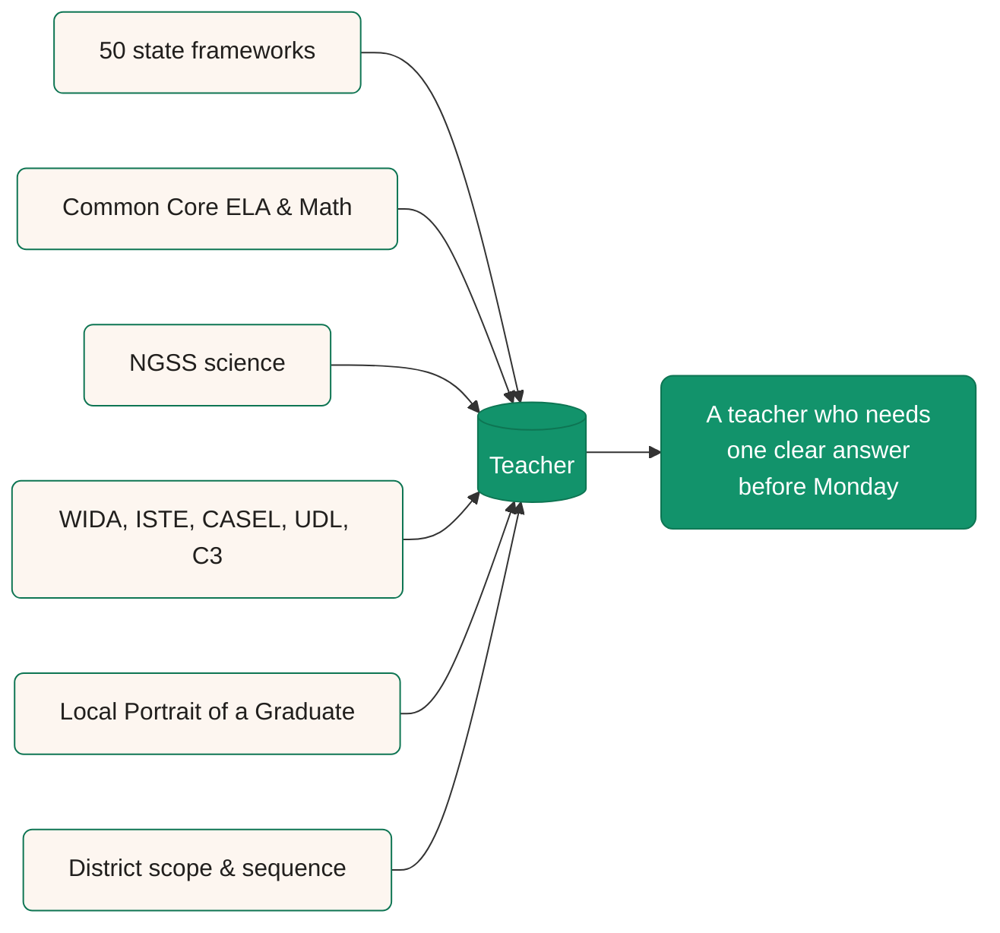

  Teachers do some of the most consequential work in the country. They do it on top of a system that buries the standards they're expected to teach. Legend Standards is a free, plain-English reference for every U.S. K-12 learning standard. We built it because the documents teachers actually use are scattered across hundreds of PDFs, and most of them were written for state boards, not for the people who teach from them on Monday morning.

## The 30-second version

- Standards are owned by 50 states and published across hundreds of PDFs. No teacher should have to hunt for them.
- The standards a teacher trained on are not the standards their state expects today. Most have been rewritten in the last decade.
- Educating the next generation is the most consequential work a country does. The reference teachers reach for should be free, and it should read like a human wrote it.
- Legend Standards is one half of how we want to help. The Legend product is the other half, where teachers turn standards into rubrics and feedback.

## Standards are varied and opaque

The United States has 50 sets of academic standards. Some are Common Core word for word. Others were rewritten from scratch by a state board that wanted to put its own name on the cover.

Add NGSS for science, WIDA for multilingual learners, ISTE for technology, and CASEL for social and emotional learning. Even inside a single state, those documents live across PDFs and crosswalk tables that few teachers ever see in one place.

The result is a teacher problem first and a parent problem second.

- A first-year teacher can't easily tell which standards their state expects, or which ones the test actually measures.
- For a veteran who moved across state lines, there's no clean way to spot what changed.
- A parent who wants to know what their fourth grader will learn this year has to wade through a 300-page state framework.

Standards should be the clearest part of the system. Most of the time, they're the hardest.

A single reference that pulls these documents together, in plain English, with the official wording next to a working classroom example, is the smallest useful thing we can do to give teachers their time back.

## Standards are changing with the times

A learning standard used to be a sentence about what a student should know. Today it sits next to a longer list of habits and competencies that follow students all the way to graduation.

Portrait of a Graduate frameworks have spread through hundreds of districts. NGSS rewrote the science standards so that doing science is built into the work, alongside the content students still need to know. None of these documents replace the academic standards a state already adopted. They sit on top of them, and teachers have to plan against all of it at once.

<Note>
  This isn't a complaint about change. The world a kindergartner today will graduate into looks nothing like the one the 1989 NCTM standards were written for. Standards should keep changing. The reference teachers turn to should keep up.
</Note>

What teachers need is a reference that moves with them. Something that names what's current and what's being phased out, and shows where a Portrait of a Graduate competency already overlaps with an academic standard their state has been teaching for years.

## Educating the next generation is the most consequential work we do

There are a hundred ways to talk about how important education is. Most of them are bumper stickers. Here's how we think about it.

The decisions a country makes about what every nine-year-old should learn compound for sixty years. The cost of doing that work poorly is paid by every classroom that comes after.

Teachers are where it all lands. They're the people who decide whether the standard on the page becomes a skill in a student's hand. Every Monday morning, the next round starts.

The reference materials and feedback tools teachers rely on should match the seriousness of the job. That's why this site is free, and why we plan to keep it free. The standards are public documents. The way they get explained to the people teaching them should be public too.

## What this site does

- Lists every U.S. K-12 learning standard in plain English, with the official wording and a classroom example for each.
- Names the publishing body so teachers and parents know who actually owns the document.
- Maps each state to the framework it uses, plus the statewide and national tests its students sit for.
- Tracks changes so a teacher coming back to fifth grade math after two years can see what moved.
- Cross-references frameworks so a Portrait of a Graduate working group can find the academic standards already covering the same ground.

It doesn't replace your state's official document. The version your state board adopted is the one your school has to teach. This site is the version that's easier to read.

## What this site does not do

- It doesn't write your rubrics for you. That work belongs to the teacher and the team.
- It doesn't grade student work. Legend's grading tools draft feedback against your rubric, and teachers review every comment before a student sees it.
- It doesn't pick your curriculum. Standards are the destination. Your district picks the route.

## Where Legend fits

This reference is one half of how we think about helping teachers. The standards live here. The feedback teachers write against those standards lives in the Legend product. Both are built on the same rule: the teacher's judgment is the one that counts. Our job is to make that judgment faster. That's the line we don't cross.

## Where to go next

<CardGroup cols={2}>
  <Card title="What are learning standards?" icon="book-open-text" href="/standards/guides/what-are-learning-standards">
    The plain-English explanation of what a learning standard is, who writes them, and how teachers actually use them.
  </Card>

  <Card title="Standards vs. curriculum vs. rubrics" icon="compass" href="/standards/guides/standards-vs-curriculum-vs-rubrics">
    Tell standards, curriculum, and rubrics apart in five minutes. Plain definitions and side-by-side examples.
  </Card>

  <Card title="Common Core" icon="library" href="/standards/common-core">
    The ELA and math standards most U.S. states anchor their academic work to.
  </Card>

  <Card title="Standards by state" icon="map" href="/">
    Every state mapped to the framework it uses and the tests its students sit for.
  </Card>
</CardGroup>

  Legend Standards is a free, plain-English reference for every U.S. K-12 learning standard. We built it for two reasons. The standards themselves are scattered across 50 states and hundreds of PDFs, and teachers shouldn't have to hunt for them. Those documents are also changing every year, with Portrait of a Graduate frameworks and updated science and SEL expectations now layered on top of the academic standards teachers already have to teach. Behind both reasons is the same conviction. Educating the next generation is the most consequential work a country does, and the reference teachers reach for should match the seriousness of the job. The site lists every standard in plain English, with the official wording and a citation back to the publishing body. The teacher's judgment stays in the teacher's hands. That's the work.

